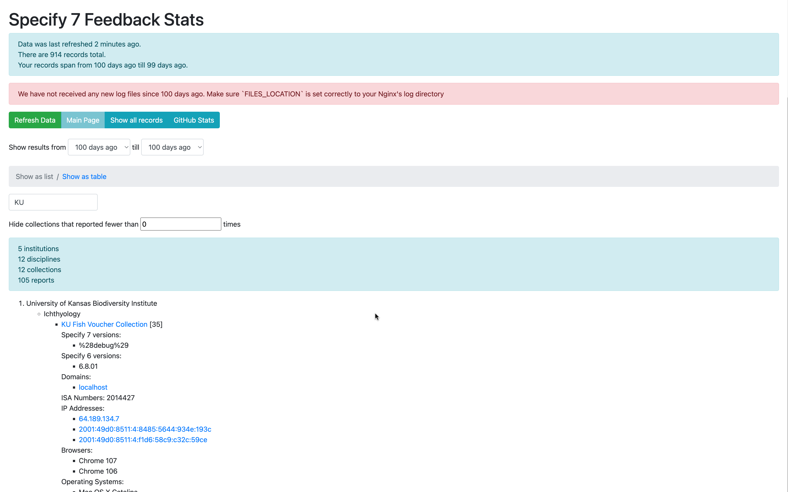
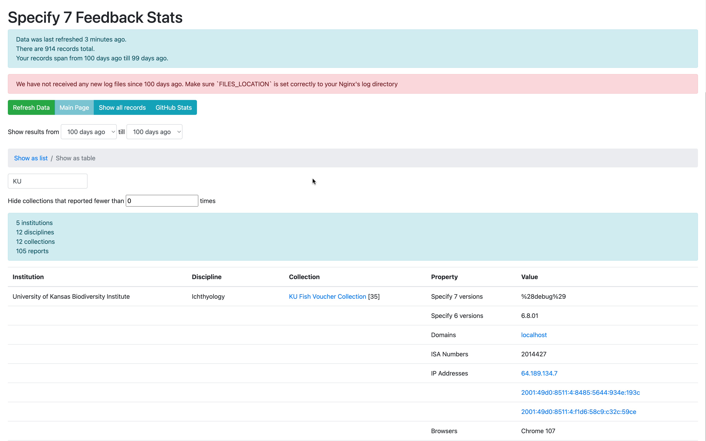
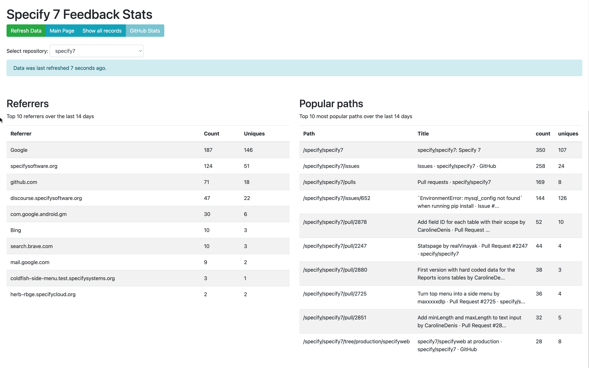

# Specify 7 Usage Statistics

This website provides some information on the usage
of [Specify 7](https://github.com/specify/specify7).

## Screenshots

Usage stats in list view:



Usage stats in table view:



GitHub repository stats:



## Installation

### Create a GitHub OAuth App

In order to enable authentication though GitHub and usage of GitHub APIs, a
GitHub OAuth application needs to be created.

This can be done for a GitHub organization or user profile:

1. Open organization / user settings on GitHub
2. On the sidebar, select "Developer Settings"
3. Select "OAuth Apps"
4. Press "New OAuth App"
5. Fill out the required information
6. Set authentication callback URL to this URL:

   ```
   https://localhost/sign-in
   ```

   When in production, replace `localhost` with the actual hostname

7. Press "Generate a new client secret"
8. Client ID and Client Secret is displayed on the OAUth app configuration page.
9. Write them down somewhere temporary as they would be needed later

### Create an Authentication Token

The "GitHub Stats" feature requires GitHub personal token. To creat it:

1. Open your GitHub's profile settings
2. Select "Developer Settings" on the sidebar
3. Select "Personal access tokens" on the next sidebar
4. Press "Generate new token"
5. Fill out name and expiration date as appropriate
6. Check the `repo` checkbox in the "Select Scopes" section
7. Press "Generate token"
8. Write down the generated token temporarily as it would be needed in the next
   step

### Configuration

1. Clone this repository
2. Install Docker and Docker compose
3. Copy `./env.example` file to `./.env` and change the variables as applicable
4. Edit `docker-compose.yml` in all the places where you see `CHANGE THIS:`
5. Generate `fullchain.pem` and `privkey.pem` (certificate
   and the private key) using Let's Encrypt and put (or symlink) these files
   into the `./sp7-stats/config/` directory.

   While in development, you can generate self-signed certificates:

   ```sh
   openssl req \
      -x509 -sha256 -nodes -newkey rsa:2048 -days 365 \
      -keyout ./sp7-stats/config/privkey.pem \
      -out ./sp7-stats/config/fullchain.pem
   ```

### Start up

Start the containers: `docker compose up -d`

### Optional settings

You can go over the other settings in the `./sp7-stats/config/optional.php` file
and see if there is anything you would like to adjust.

For example:

1. You can set up daily cron to the following
   location `http://<yourdomain>/cron/refresh_data.php`. This will automatically
   unzip the files and compile the information so that users can get up to date
   information.
2. You can change the duration of time before compiled data is considered out of
   date by changing `SHOW_DATA_OUT_OF_DATE_WARNING_AFTER`. The default value is
   86400 = 1
   day[]()
